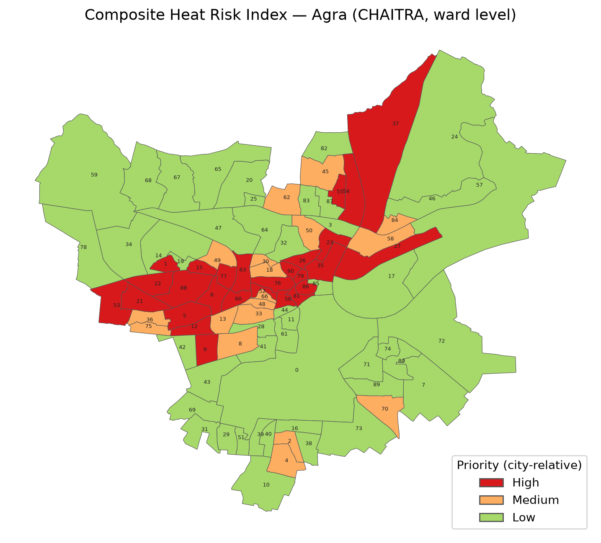
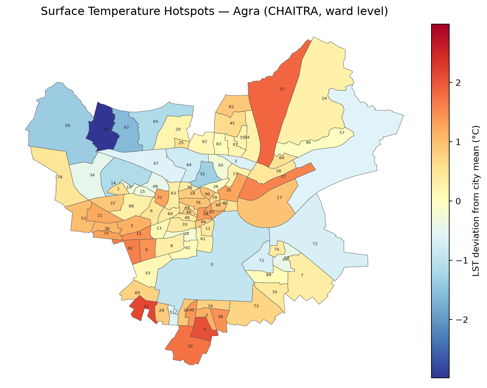
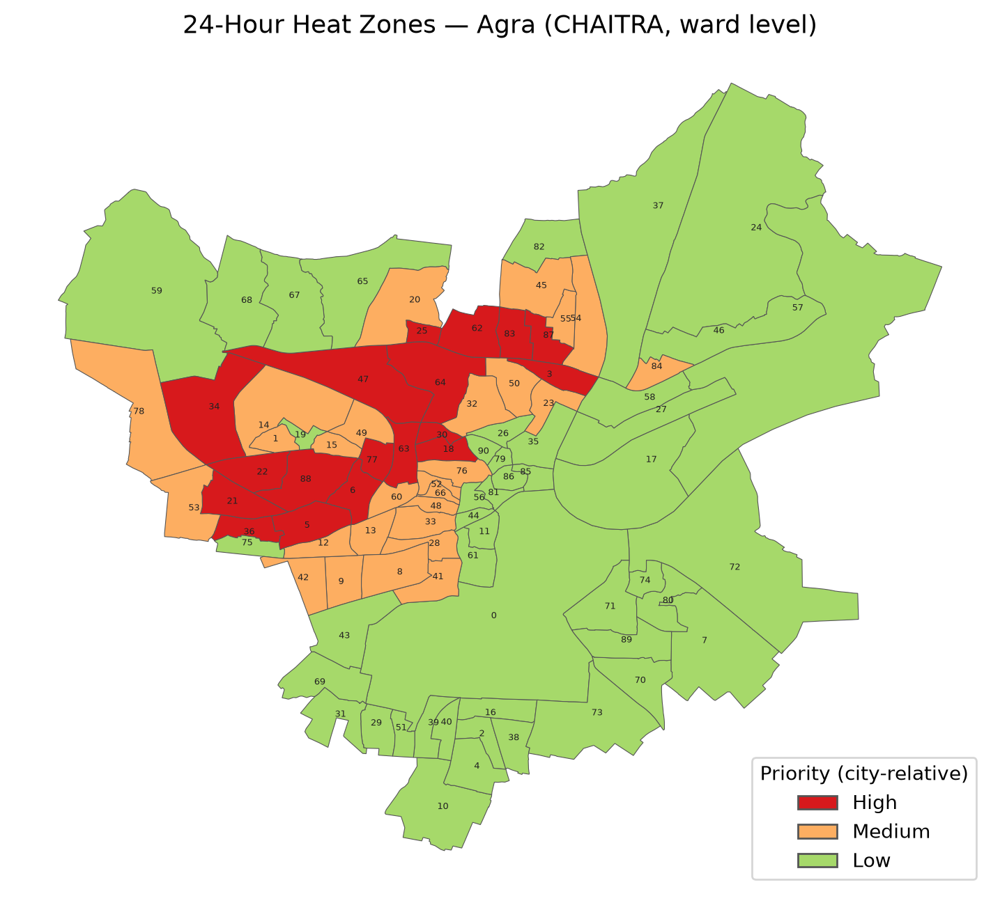
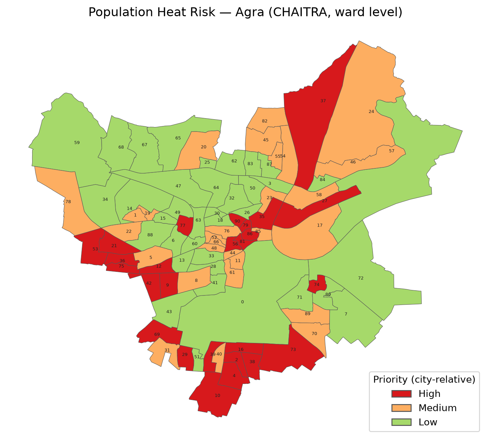
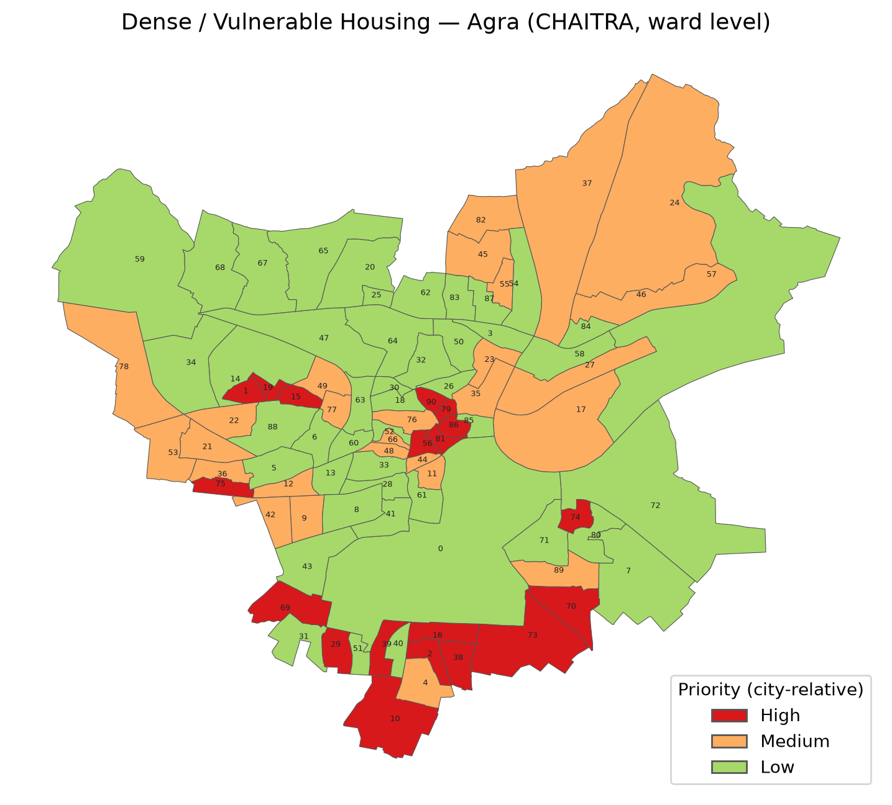
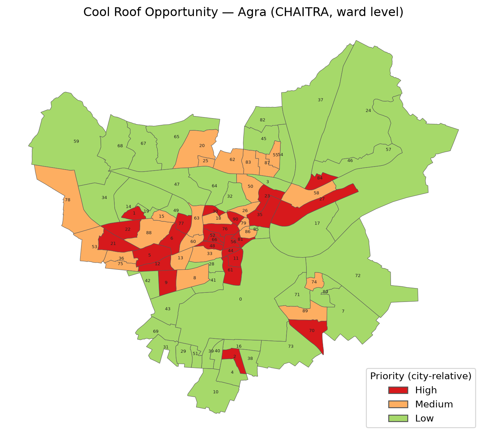
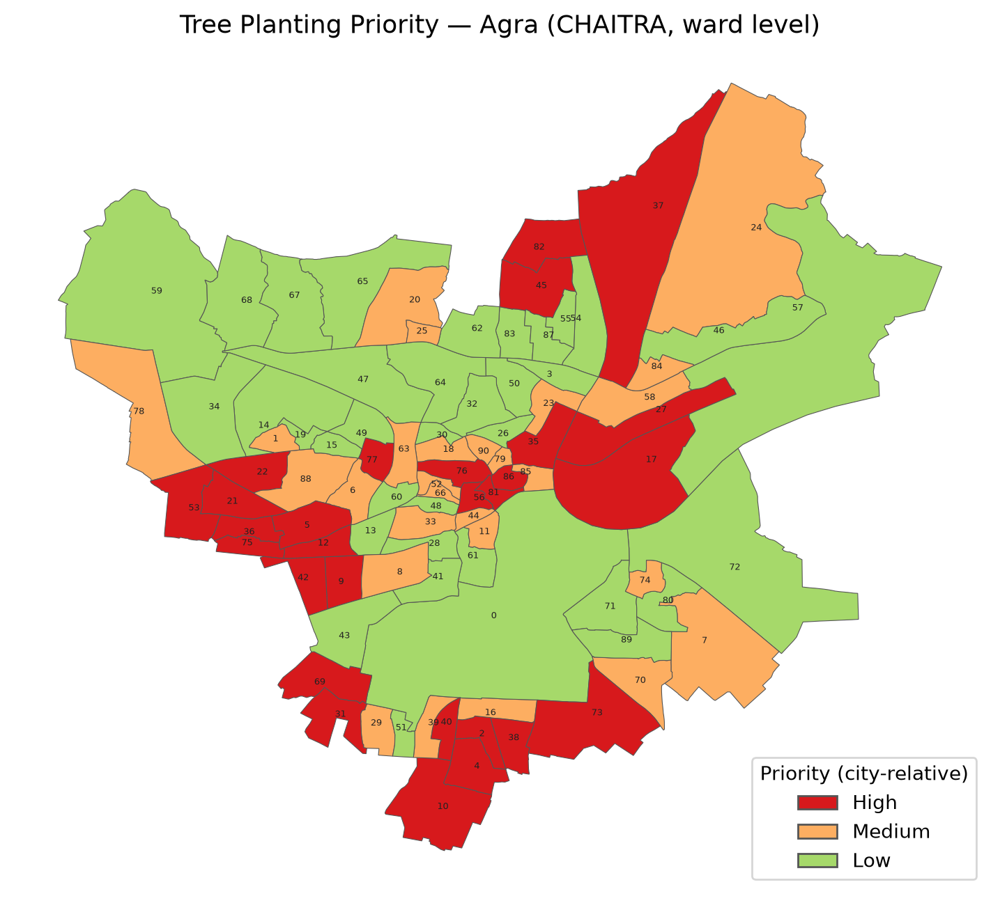

# Heat Action Plan for Agra — DRAFT

## 1. Important Notice — Use With Caution

This document is a draft Heat Action Plan generated from CHAITRA, a satellite-derived, ward-level heat analysis. It must be read with the following limitations firmly in view:

- The analysis is derived from satellite observation. It has **no knowledge of what specific land parcels are or mean locally** — a surface the satellite records as hot or un-vegetated may be a school, a playground, a market, a religious or heritage site, or a community space. The data cannot distinguish these.
- **No figure or priority in this document authorises any physical action.** Nothing herein is a sanction for demolition, clearance, eviction, or repurposing of any land or structure.
- Every intervention proposed here requires a **ground survey and community consultation before any action is taken**.
- All High/Medium/Low classifications are **relative to Agra's own distribution**. A ward classified "Low" is not heat-safe; it is merely less severely placed than other wards in this city.
- Population inputs are modelled (WorldPop 2020); they inform the risk scores but are **not printed per ward**, and must be reconciled with current municipal records before any resource allocation.
- Ward numbering follows the source ward map and **must be reconciled with the municipality's current ward numbering** before use.
- Contextual statements marked with an asterisk (*) are drawn from public sources and the drafting model's knowledge; they have **not** been confirmed and must be checked by qualified officials before publication. Policy and disaster-notification status in particular can change after this document was drafted — re-check any such statement, even a previously confirmed one, before relying on this plan if it is more than a few months old.
- Fields marked "To be completed by city officials" require local input before this plan is actionable.

## 2. Introduction

This Heat Action Plan for Agra is grounded in CHAITRA's ward-level satellite analysis of the city's summer heat. Its purpose is to give the Municipal Corporation and district administration a practical, ward-by-ward basis for targeting heat interventions — cool roofs, tree planting, health preparedness, and worker protection — where they are needed most. The plan covers all 91 wards of the city.

## 3. Understanding the Local Context

### 3.1 The City, Its People, and Their Work

Agra is one of Uttar Pradesh's principal cities Census 2011 recorded a population of approximately 15.8 lakh in the Agra municipal area, with the urban agglomeration exceeding 17 lakh\*, situated on the banks of the Yamuna in the state's semi-arid southwest. Its population skews young as in most Uttar Pradesh cities, a large share of residents are of working age, and roughly one in nine is a child below six years per Census 2011\*, and a substantial share lives in dense, low-income neighbourhoods with limited green cover — precisely the wards this plan's Composite Heat Risk Index flags as priority (Section 6).

The city's working life is dominated by streams of work that place people outdoors or in un-cooled indoor spaces through the hottest hours of the day, and it is these groups the Labour Department and health system must reach first when an alert is issued (Section 8). Tourism anchored by the Taj Mahal — together with the Agra Fort and nearby Fatehpur Sikri — supports a very large workforce of guides, vendors, rickshaw and e-rickshaw operators, photographers, and hospitality staff the Taj Mahal alone draws several million visitors each year\*. Agra is also one of India's foremost footwear and leather manufacturing clusters the Agra footwear cluster is estimated to produce a substantial share of India's footwear and to employ several lakh workers, much of it in small household units\*, and hosts a celebrated artisan economy — marble inlay (parchin kari) workers, petha confectioners, and metal and handicraft workers — much of it operating from small, poorly ventilated workshops. Construction labour, street vending, and informal daily-wage work round out the picture. These livelihoods concentrate heat exposure precisely in the populations least able to stop working on hot days, which is why Section 8 assigns the Labour Department and tourism authorities specific, ward-targeted responsibilities rather than a generic advisory.

### 3.2 The City's Climate

Agra has a hot semi-arid climate. The summer season runs from April to July, with an intensely hot, dry phase through April–June daytime maxima commonly reach 44–48 °C in May and June\*, followed by rising humidity as the monsoon approaches, which pushes physiological heat stress higher even as air temperatures ease. Nights during peak summer offer limited relief in the built-up core of the city — the wards where this matters most are identified under 24-Hour Heat Zones (Section 6).

### 3.3 How Severe Has the Heat Been

The recent record leaves no doubt about the severity of Agra's heat, and is the direct justification for treating this HAP as an operational document rather than a reference report:

- In May 2024, Agra recorded 47.7 °C — the second-highest temperature in Uttar Pradesh that month\*
- In June 2024, Agra crossed 46 °C and was at times the hottest station in the state; the IMD kept Agra and surrounding districts under severe heatwave warnings through the third week of June\*
- The summer of 2024 formed part of the longest stretch of extreme heat India had recorded since 2010, with temperatures across the Uttar Pradesh plains breaching 40 °C for close to a month\*
- Between 15 and 18 June 2024, the region endured four consecutive severe warm nights, with minimum temperatures 4–7 °C above normal — the pattern most strongly associated with heat mortality, because the body cannot recover overnight\*
- Uttar Pradesh reported significant heat mortality in 2024, including 54 deaths reported in Ballia district during one June spell and 33 polling personnel who died of heatstroke during the general election\*

CHAITRA's satellite record confirms that this severity is written into the city's surfaces. Over the summer analysis window (2022-04-01 to 2024-07-31), Agra's mean daytime land surface temperature was **45.3 °C**. Of the city's 132.2 km², **125.3 km² — nearly the entire city — exceeded a surface temperature of 40 °C**, 83.5 km² exceeded 45 °C, and 1.2 km² exceeded 50 °C. The hottest one percent of the city's surface reached 49.9 °C or more, against a cool vegetation reference of 40.7 °C — meaning the built city runs several degrees hotter than its own green spaces. The city's mean nighttime land surface temperature was 20.0 °C, with the densest wards retaining measurably more heat after dark. Sections 6 through 9 turn this record into a ward-by-ward, agency-by-agency plan of action.

## 4. Policy & Institutional Context

This plan does not stand alone; it plugs into an existing scaffolding of state and national policy, and every fact below is stated because of what it lets a named actor do.

**Heatwave disaster status — recently updated.** On 4 August 2026, the Union Home Ministry notified heatwaves — together with lightning — as disasters under the national SDRF/NDRF operational guidelines, acting on a recommendation of the 16th Finance Commission submitted on 17 November 2025. This is the first time heatwave has been added to India's NATIONALLY notified disaster list, rather than remaining only a state-specific "local disaster."\* **What this unlocks for Agra:** the notification permits both the State Disaster Response Fund and the National Disaster Response Fund to be used for heatwave relief, assistance, AND mitigation measures — not ex-gratia death relief alone — giving the District Collectorate and the Uttar Pradesh government a larger and more secure funding channel than the earlier state-only route, which had capped heatwave spending at 10% of the State Disaster Response Fund as a "local disaster."\* Concretely, this plan's cool-roof and tree-planting programmes (Section 7) and its early-warning system (Section 9) are exactly the category of mitigation measure this designation is intended to finance; the District Magistrate's office should confirm with the state Relief Commissioner which SDRF/NDRF budget heads and application process now apply. Uttar Pradesh's own earlier state notification and its district-specific alert-threshold system (below) remain the operational basis for declaring a local alert — the national notification adds a funding channel on top of that state framework, it does not replace it\*

**State-level climate and heat planning — and what it directs Agra to do.** Uttar Pradesh has a State Action Plan on Climate Change first issued in 2014 and updated as SAPCC 2.0 covering 2021–2030, prepared by the Department of Environment, Forest and Climate Change\*, which identifies extreme heat among the state's climate risks and is the umbrella under which this document is being prepared. Operationally, the Uttar Pradesh State Disaster Management Authority issues a state Heat Wave Action Plan most recently the UPSDMA Heat Wave Action Plan 2024\*, which directs district administrations to prepare and implement local heat measures — this is the mandate that makes drafting an Agra-specific HAP a district obligation, not a discretionary exercise. Uttar Pradesh became the first state in India to notify district-specific heatwave alert thresholds for all 75 districts, replacing a single statewide trigger with a three-tier, colour-coded system calibrated to local temperature baselines (yellow, orange, and red alert bands, with red generally above 41 °C)\* Those local thresholds are exactly what Agra's officials need to enter into the Section 9 alert template so it functions as a live tool rather than a placeholder.

**Existing schemes this plan can draw on — and how:**

- Uttar Pradesh has been drafting an urban cooling policy with technical support from NRDC, covering cool roofs and cooling access in cities\* → the natural funding and technical-standards partner for the cool-roof programme in Section 7.
- The state's Urban Green Policy promotes Miyawaki plantations, sponge parks, green roofs, and vertical gardens in cities\* → directly applicable to the 28 High tree-planting-priority wards identified under Tree Planting Priority (Section 6).
- Agra is a Smart Cities Mission city, and Smart City funds have been used in other Indian cities for cool-roof and shading interventions\* → a candidate funding source for the ₹58.85 crore cool-roof programme in Section 7, to be confirmed with the Smart City SPV.
- National frameworks — the NDMA heatwave guidelines and the India Cooling Action Plan — provide standards for heat-health action and cooling access\* → the technical standard this plan's health and cooling measures (Sections 8–9) should be checked against.
- *To be completed by city officials — any Agra Nagar Nigam or Agra Development Authority schemes already sanctioned for roofs, greening, shelters, or water kiosks, to be listed by the Corporation.* → once listed, cross-reference against the High-priority wards in Section 6 to identify gaps this plan should fill first.

*(Long-range temperature-trend and climate-projection analysis is intentionally omitted from this plan.)*

## 5. About CHAITRA & Data Sources

CHAITRA is a satellite-derived, ward-level heat diagnostic built on Google Earth Engine. It combines thermal imagery, population, land cover, vegetation, and built-environment data into seven output layers that classify every ward in the city — by heat hazard, by exposure and vulnerability, and by suitability for the two highest-value physical interventions (cool roofs and tree planting). All classifications are computed relative to Agra's own distribution, using city-specific percentiles. Every number in Sections 6 and 7 of this plan is taken directly from that analysis; none is estimated by the drafting process.

| Metric / Layer | Source & Resolution |
|---|---|
| Daytime land surface temperature (°C) | Landsat 8/9 Collection 2 L2 thermal, 30 m, summer (Apr–Jul) median composite, cloud-masked |
| Nighttime land surface temperature (°C) | MODIS Terra+Aqua (MOD11A1/MYD11A1), 1 km, 2-year median |
| Population (persons) | WorldPop, 100 m, 2020 |
| Land cover (class) | ESA WorldCover v200, 10 m, 2021 |
| Tree canopy (% cover) | Google Dynamic World, 10 m |
| Albedo — roof and surface reflectivity (0–1 index) | Sentinel-2 broadband albedo (Liang 2001 coefficients), 10 m |
| Built density — housing vulnerability input (composite score) | GHSL Built Surface (2020) with vegetation deficit and VIIRS nightlight dimness, multi-source composite |
| Ward boundaries (ward polygon) | Municipal ward shapefile as hosted in CHAITRA. *To be completed by city officials — shapefile vintage and provenance to be provided by city officials.* |

## 6. Heat Risk Analysis — CHAITRA Output Layers

This section walks through CHAITRA's output layers for Agra — the map panels — one at a time. For each: what the layer measures, which wards fall in each priority class and why, and what to do about it.

### 6.1 Composite Heat Risk Index

*Figure: Composite Heat Risk Index, ward-level map generated from the CHAITRA analysis. Classifications are relative to Agra's own distribution.*

The Composite Heat Risk Index is CHAITRA's headline layer. Following the IPCC AR6 risk framework, each ward's score is the geometric mean of Hazard (daytime and nighttime heat), Exposure (population), and Vulnerability (canopy deficit, housing density, dark roofs). It answers the question: *where do dangerous heat, many people, and low coping capacity coincide?*

- **High (27 wards):** Ward 1, Ward 5, Ward 6, Ward 9, Ward 12, Ward 15, Ward 21, Ward 22, Ward 23, Ward 26, Ward 27, Ward 35, Ward 37, Ward 52, Ward 53, Ward 54, Ward 55, Ward 56, Ward 60, Ward 63, Ward 76, Ward 77, Ward 79, Ward 81, Ward 86, Ward 88, Ward 90. These wards consistently combine near-total loss of tree canopy with dense, low-rise housing and above-average daytime *and* nighttime heat — the three conditions the Index is designed to catch acting together. The population living in these 27 wards is **239,455** (modelled estimate, WorldPop 2020).
- **Medium (18 wards):** Ward 2, Ward 4, Ward 8, Ward 13, Ward 18, Ward 30, Ward 33, Ward 36, Ward 45, Ward 48, Ward 49, Ward 50, Ward 58, Ward 62, Ward 66, Ward 70, Ward 75, Ward 84. Typically these wards are missing one of the three High-ward conditions — moderately built-up but with somewhat more vegetation, or hot but less densely populated.
- **Low (46 wards):** Ward 0, Ward 3, Ward 7, Ward 10, Ward 11, Ward 14, Ward 16, Ward 17, Ward 19, Ward 20, Ward 24, Ward 25, Ward 28, Ward 29, Ward 31, Ward 32, Ward 34, Ward 38, Ward 39, Ward 40, Ward 41, Ward 42, Ward 43, Ward 44, Ward 46, Ward 47, Ward 51, Ward 57, Ward 59, Ward 61, Ward 64, Ward 65, Ward 67, Ward 68, Ward 69, Ward 71, Ward 72, Ward 73, Ward 74, Ward 78, Ward 80, Ward 82, Ward 83, Ward 85, Ward 87, Ward 89. These wards carry meaningfully more vegetation and register close to zero deviation from the city's average heat — the periphery and greener neighbourhoods.

**What to do with this layer:** treat the High class as the city's heat-priority list. Every measure in this plan — roof coating, planting, shelters, health outreach, alert dissemination — should reach these 27 wards first.

### 6.2 Surface Temperature Hotspots

*Figure: Surface Temperature Hotspots, ward-level map generated from the CHAITRA analysis. Classifications are relative to Agra's own distribution.*

This layer maps each ward's mean daytime land surface temperature and its deviation from the city mean of 45.3 °C, isolating the wards whose surfaces run hottest under the late-morning sun.

The strongest daytime hotspots are Ward 31 (ward mean 47.5 °C, deviation +2.1 °C), Ward 4 (47.4 °C, +2.1 °C), Ward 37 (47.2 °C, +1.8 °C), Ward 10 (47.1 °C, +1.7 °C), and Wards 27 and 42 (46.9 °C, +1.6 °C each) — these are the wards where shaded walkways, water points, and shifted outdoor working hours will have the largest measurable effect. At the other end, the greenest periphery runs markedly cooler — Ward 68 sits 3.0 °C below the city mean, Ward 67 1.6 °C below, and Ward 59 1.4 °C below — demonstrating, within Agra itself, how much surface temperature vegetation removes, and giving the horticulture wing a concrete reason to protect what already exists there.

**What to do with this layer:** deploy daytime measures — shaded walkways, water points, altered outdoor working hours, and reflective surfaces — in the hotspot wards named above, and protect the vegetation that keeps the cool wards cool rather than allowing it to be cleared.

### 6.3 24-Hour Heat Zones

*Figure: 24-Hour Heat Zones, ward-level map generated from the CHAITRA analysis. Classifications are relative to Agra's own distribution.*

This layer combines daytime heat, nighttime heat retention (MODIS), population, and nightlight activity into a single score identifying zones that stay dangerously hot around the clock — where outdoor evening economies and dense housing keep people exposed after sunset, and where warm nights deny the body recovery.

- **High (18 wards):** Ward 3, Ward 5, Ward 6, Ward 18, Ward 21, Ward 22, Ward 25, Ward 30, Ward 34, Ward 36, Ward 47, Ward 62, Ward 63, Ward 64, Ward 77, Ward 83, Ward 87, Ward 88. These wards combine the strongest overnight heat retention in the city with above-average population density — exactly the combination that denies residents recovery from daytime heat.
- **Medium (27 wards):** Ward 1, Ward 8, Ward 9, Ward 12, Ward 13, Ward 14, Ward 15, Ward 20, Ward 23, Ward 28, Ward 32, Ward 33, Ward 41, Ward 42, Ward 45, Ward 48, Ward 49, Ward 50, Ward 52, Ward 53, Ward 54, Ward 55, Ward 60, Ward 66, Ward 76, Ward 78, Ward 84.
- **Low (46 wards):** Ward 0, Ward 2, Ward 4, Ward 7, Ward 10, Ward 11, Ward 16, Ward 17, Ward 19, Ward 24, Ward 26, Ward 27, Ward 29, Ward 31, Ward 35, Ward 37, Ward 38, Ward 39, Ward 40, Ward 43, Ward 44, Ward 46, Ward 51, Ward 56, Ward 57, Ward 58, Ward 59, Ward 61, Ward 65, Ward 67, Ward 68, Ward 69, Ward 70, Ward 71, Ward 72, Ward 73, Ward 74, Ward 75, Ward 79, Ward 80, Ward 81, Ward 82, Ward 85, Ward 86, Ward 89, Ward 90. Nights cool measurably more here and population density is lower, so overnight exposure is comparatively limited even where daytime heat is a concern.

**What to do with this layer:** direct night-focused measures at the 18 High wards — cooling shelters that stay open overnight, evening outreach to street and market workers, and priority in any warm-night alert protocol.

### 6.4 Population Heat Risk

*Figure: Population Heat Risk, ward-level map generated from the CHAITRA analysis. Classifications are relative to Agra's own distribution.*

This layer weights heat hazard by how many people actually live under it, flagging wards where high temperatures coincide with large or dense resident populations.

- **High (26 wards):** Ward 2, Ward 4, Ward 9, Ward 10, Ward 12, Ward 16, Ward 21, Ward 27, Ward 29, Ward 35, Ward 36, Ward 37, Ward 38, Ward 39, Ward 42, Ward 53, Ward 56, Ward 69, Ward 73, Ward 74, Ward 75, Ward 77, Ward 79, Ward 81, Ward 86, Ward 90. Heat exposure, not population density alone, drives this group — these wards register the sharpest daytime heat deviation in the city on top of substantial population.
- **Medium (28 wards):** Ward 1, Ward 5, Ward 8, Ward 11, Ward 17, Ward 19, Ward 20, Ward 22, Ward 23, Ward 24, Ward 31, Ward 40, Ward 44, Ward 45, Ward 46, Ward 48, Ward 52, Ward 54, Ward 55, Ward 58, Ward 61, Ward 66, Ward 70, Ward 76, Ward 78, Ward 82, Ward 85, Ward 89.
- **Low (37 wards):** Ward 0, Ward 3, Ward 6, Ward 7, Ward 13, Ward 14, Ward 15, Ward 18, Ward 25, Ward 26, Ward 28, Ward 30, Ward 32, Ward 33, Ward 34, Ward 41, Ward 43, Ward 47, Ward 49, Ward 50, Ward 51, Ward 57, Ward 59, Ward 60, Ward 62, Ward 63, Ward 64, Ward 65, Ward 67, Ward 68, Ward 71, Ward 72, Ward 80, Ward 83, Ward 84, Ward 87, Ward 88. Several of these wards carry comparable population density to Medium- or even High-ranked wards, but register far lower heat deviation — a reminder that density alone does not create heat risk without the temperature to go with it.

**What to do with this layer:** size and place people-facing services by it — ORS and water distribution, health-worker rounds, ward-level awareness drives — so that coverage is proportional to the number of people at risk, not just the temperature.

### 6.5 Dense / Vulnerable Housing

*Figure: Dense / Vulnerable Housing, ward-level map generated from the CHAITRA analysis. Classifications are relative to Agra's own distribution.*

This layer scores the building stock: dense, low-rise construction with little vegetation and dim nighttime lighting — the signature of informal or under-served neighbourhoods whose homes trap heat and whose residents have the fewest cooling options.

- **High (19 wards):** Ward 1, Ward 2, Ward 10, Ward 15, Ward 16, Ward 19, Ward 29, Ward 38, Ward 39, Ward 56, Ward 69, Ward 70, Ward 73, Ward 74, Ward 75, Ward 79, Ward 81, Ward 86, Ward 90. These wards combine the highest building density in the city with almost no vegetation and dim nighttime lighting — the strongest satellite signature of informal or under-resourced settlement.
- **Medium (27 wards):** Ward 4, Ward 9, Ward 11, Ward 12, Ward 17, Ward 21, Ward 22, Ward 23, Ward 24, Ward 27, Ward 35, Ward 36, Ward 37, Ward 42, Ward 44, Ward 45, Ward 46, Ward 48, Ward 49, Ward 53, Ward 55, Ward 66, Ward 76, Ward 77, Ward 78, Ward 82, Ward 89.
- **Low (45 wards):** Ward 0, Ward 3, Ward 5, Ward 6, Ward 7, Ward 8, Ward 13, Ward 14, Ward 18, Ward 20, Ward 25, Ward 26, Ward 28, Ward 30, Ward 31, Ward 32, Ward 33, Ward 34, Ward 40, Ward 41, Ward 43, Ward 47, Ward 50, Ward 51, Ward 52, Ward 54, Ward 57, Ward 58, Ward 59, Ward 60, Ward 61, Ward 62, Ward 63, Ward 64, Ward 65, Ward 67, Ward 68, Ward 71, Ward 72, Ward 80, Ward 83, Ward 84, Ward 85, Ward 87, Ward 88. More vegetation and better-lit surroundings distinguish this group from the High wards above.

**What to do with this layer:** direct habitat-level measures at the 19 High wards — subsidised or free cool-roof coating for low-income homes, ventilation improvements, and priority inclusion in any housing-upgradation scheme. Because this layer indicates *probable* informal settlement from satellite signatures only, ground verification (Section 1) is mandatory before any parcel-level action.

### 6.6 Cool Roof Opportunity

*Figure: Cool Roof Opportunity, ward-level map generated from the CHAITRA analysis. Classifications are relative to Agra's own distribution.*

This layer identifies wards where coating dark roofs with reflective material would deliver the greatest relief: it combines ward temperature, built fraction, and roof-albedo deficit. Agra's city mean rooftop albedo is 0.173 — a dark-roofed city overall, so the deciding factor between wards is less which roofs are darkest and more which wards combine the hottest surfaces with the most built-up area to coat.

- **High (25 wards):** Ward 1, Ward 2, Ward 5, Ward 6, Ward 9, Ward 11, Ward 12, Ward 21, Ward 22, Ward 23, Ward 27, Ward 30, Ward 35, Ward 44, Ward 48, Ward 52, Ward 56, Ward 61, Ward 66, Ward 70, Ward 76, Ward 77, Ward 81, Ward 84, Ward 90. These wards pair the hottest daytime surfaces in the city with a high built-up fraction, so a coated roof reaches the most heat-exposed built area per rupee spent.
- **Medium (25 wards):** Ward 8, Ward 13, Ward 15, Ward 18, Ward 20, Ward 25, Ward 26, Ward 33, Ward 36, Ward 50, Ward 53, Ward 55, Ward 58, Ward 60, Ward 62, Ward 63, Ward 74, Ward 75, Ward 78, Ward 79, Ward 83, Ward 86, Ward 87, Ward 88, Ward 89.
- **Low (41 wards):** Ward 0, Ward 3, Ward 4, Ward 7, Ward 10, Ward 14, Ward 16, Ward 17, Ward 19, Ward 24, Ward 28, Ward 29, Ward 31, Ward 32, Ward 34, Ward 37, Ward 38, Ward 39, Ward 40, Ward 41, Ward 42, Ward 43, Ward 45, Ward 46, Ward 47, Ward 49, Ward 51, Ward 54, Ward 57, Ward 59, Ward 64, Ward 65, Ward 67, Ward 68, Ward 69, Ward 71, Ward 72, Ward 73, Ward 80, Ward 82, Ward 85. Lower daytime surface temperature or lower built fraction means coating here delivers less relief per rupee than in the High wards.

**What to do with this layer:** run the cool-roof programme ward-wise down the High list, beginning with wards that also rank High on the Composite Index and Dense/Vulnerable Housing layers, where a coated roof does the most for the most vulnerable households. Across the 25 High-priority wards, **310 ha of dark roof area needs treatment, at an estimated coating cost of ₹58.85 crore** (at ₹150-230/m², midpoint ₹190/m²). The per-ward quantities are in Section 7.

### 6.7 Tree Planting Priority

*Figure: Tree Planting Priority, ward-level map generated from the CHAITRA analysis. Classifications are relative to Agra's own distribution.*

This layer ranks wards by where new tree canopy is most needed and most beneficial, combining canopy deficit, exposed population, and heat intensity.

- **High (28 wards):** Ward 2, Ward 4, Ward 5, Ward 9, Ward 10, Ward 12, Ward 17, Ward 21, Ward 22, Ward 27, Ward 31, Ward 35, Ward 36, Ward 37, Ward 38, Ward 40, Ward 42, Ward 45, Ward 53, Ward 56, Ward 69, Ward 73, Ward 75, Ward 76, Ward 77, Ward 81, Ward 82, Ward 86.
- **Medium (27 wards):** Ward 1, Ward 6, Ward 7, Ward 8, Ward 11, Ward 16, Ward 18, Ward 20, Ward 23, Ward 24, Ward 25, Ward 29, Ward 33, Ward 39, Ward 44, Ward 52, Ward 58, Ward 63, Ward 66, Ward 70, Ward 74, Ward 78, Ward 79, Ward 84, Ward 85, Ward 88, Ward 90. High and Medium wards share the same signature — built-up areas with almost no existing canopy and residents living in low-canopy conditions — and are ranked apart mainly by how much exposed population and heat intensity compound the same underlying deficit.
- **Low (36 wards):** Ward 0, Ward 3, Ward 13, Ward 14, Ward 15, Ward 19, Ward 26, Ward 28, Ward 30, Ward 32, Ward 34, Ward 41, Ward 43, Ward 46, Ward 47, Ward 48, Ward 49, Ward 50, Ward 51, Ward 54, Ward 55, Ward 57, Ward 59, Ward 60, Ward 61, Ward 62, Ward 64, Ward 65, Ward 67, Ward 68, Ward 71, Ward 72, Ward 80, Ward 83, Ward 87, Ward 89. These wards already carry meaningfully more canopy than the High/Medium group, so they need reinforcement and protection rather than a new planting programme.

**What to do with this layer:** hand the High-priority list to the horticulture wing and Forest Department as the city's planting programme, siting saplings through ground survey (schools, road margins, parks, and community land identified locally — the satellite data does not choose sites). Across the 28 High-priority wards the canopy deficit is **550 ha**, requiring **111,366 saplings** (at 150 trees per hectare of deficit with a ×1.35 mortality buffer), at an estimated cost of **₹15.59 crore** (₹1,400 per tree including 3-year maintenance). Protect existing canopy in the cool wards identified under the Surface Temperature Hotspots layer above.

## 7. Recommended Interventions

The two physical interventions CHAITRA quantifies for Agra are cool roofs and tree planting. The figures below are the pipeline's computed quantities for every ward classified High priority on the respective layer; they are planning-scale estimates, to be refined by ground survey. Costs are shown in ₹ lakh below ₹1 crore and in ₹ crore at or above, for readability.

**Cool roofs — 25 High-priority wards.** Total dark roof area needing treatment: **310 ha**; estimated coating cost **₹58.85 crore** (₹150-230/m², midpoint ₹190/m²).

| Ward No. | Dark Roof Area (ha) | Estimated Coating Cost |
|---|---|---|
| 44 | 4.6 | ₹86.5 lakh |
| 9 | 15.4 | ₹2.92 crore |
| 52 | 5.3 | ₹1.01 crore |
| 77 | 10.2 | ₹1.95 crore |
| 56 | 6.4 | ₹1.22 crore |
| 2 | 10.5 | ₹1.99 crore |
| 84 | 12.6 | ₹2.39 crore |
| 27 | 36.9 | ₹7.00 crore |
| 81 | 5.1 | ₹97.8 lakh |
| 12 | 11.6 | ₹2.21 crore |
| 5 | 20.9 | ₹3.96 crore |
| 76 | 11.8 | ₹2.24 crore |
| 11 | 8.4 | ₹1.60 crore |
| 30 | 5.6 | ₹1.06 crore |
| 66 | 3.4 | ₹65.3 lakh |
| 61 | 15.1 | ₹2.88 crore |
| 90 | 5.2 | ₹98.7 lakh |
| 6 | 14.1 | ₹2.68 crore |
| 35 | 17.2 | ₹3.26 crore |
| 1 | 8.0 | ₹1.52 crore |
| 48 | 5.8 | ₹1.10 crore |
| 21 | 18.9 | ₹3.59 crore |
| 22 | 18.4 | ₹3.50 crore |
| 70 | 25.7 | ₹4.89 crore |
| 23 | 12.7 | ₹2.41 crore |

**Tree planting — 28 High-priority wards.** Total canopy deficit: **550 ha**; saplings to plant: **111,366** (150 trees/ha of deficit, ×1.35 mortality buffer); estimated cost **₹15.59 crore** (₹1,400/tree including 3-year maintenance).

| Ward No. | Canopy Deficit (ha) | Saplings to Plant | Estimated Cost |
|---|---|---|---|
| 37 | 101.7 | 20,587 | ₹2.88 crore |
| 10 | 36.5 | 7,394 | ₹1.04 crore |
| 27 | 30.7 | 6,210 | ₹86.9 lakh |
| 42 | 12.3 | 2,494 | ₹34.9 lakh |
| 4 | 13.7 | 2,771 | ₹38.8 lakh |
| 31 | 11.8 | 2,394 | ₹33.5 lakh |
| 35 | 15.4 | 3,115 | ₹43.6 lakh |
| 9 | 12.1 | 2,455 | ₹34.4 lakh |
| 12 | 9.5 | 1,932 | ₹27.0 lakh |
| 38 | 11.0 | 2,221 | ₹31.1 lakh |
| 21 | 16.6 | 3,358 | ₹47.0 lakh |
| 5 | 17.2 | 3,486 | ₹48.8 lakh |
| 17 | 55.8 | 11,297 | ₹1.58 crore |
| 77 | 8.2 | 1,661 | ₹23.3 lakh |
| 56 | 5.2 | 1,051 | ₹14.7 lakh |
| 81 | 4.2 | 844 | ₹11.8 lakh |
| 40 | 5.3 | 1,074 | ₹15.0 lakh |
| 53 | 21.0 | 4,244 | ₹59.4 lakh |
| 75 | 7.8 | 1,572 | ₹22.0 lakh |
| 36 | 9.7 | 1,974 | ₹27.6 lakh |
| 82 | 18.8 | 3,817 | ₹53.4 lakh |
| 2 | 7.8 | 1,572 | ₹22.0 lakh |
| 22 | 15.5 | 3,147 | ₹44.1 lakh |
| 73 | 44.0 | 8,902 | ₹1.25 crore |
| 76 | 9.6 | 1,939 | ₹27.1 lakh |
| 86 | 5.0 | 1,012 | ₹14.2 lakh |
| 69 | 19.7 | 3,999 | ₹56.0 lakh |
| 45 | 23.9 | 4,844 | ₹67.8 lakh |

No intervention is recommended for wards without supporting data on these layers.

## 8. Inter-Agency Coordination Chart

No single agency can deliver this plan. Each CHAITRA output calls on a different combination of bodies, and the plan works only if they act together. The chart below assigns each intervention a lead agency and its supporting agencies, and names the CHAITRA layer that tells that group *where* to act. A Nodal Officer — *To be completed by city officials — name and designation of the Heat Action Plan Nodal Officer, to be appointed by the Municipal Commissioner.* — coordinates the whole, convening the agencies before the heat season, during alerts, and for post-season review.

| Intervention | Lead agency | Supporting agencies | CHAITRA layer it draws on | Action |
|---|---|---|---|---|
| Cool-roof programme | Agra Nagar Nigam exact wing — engineering or health\* | DVVNL (electricity distribution)\*, Smart City SPV, RWAs, NGOs | Cool Roof Opportunity | Coat dark roofs ward-wise in the 25 High-priority wards, low-income homes first |
| Urban greening & canopy | Agra Nagar Nigam horticulture wing | Forest Department, Agra Development Authority\*, schools, community groups | Tree Planting Priority | Plant and maintain saplings in the 28 High-deficit wards; protect existing canopy |
| Heat alerts & early warning | District Disaster Management Authority (District Magistrate) | India Meteorological Department regional centre Lucknow\*, UPSDMA, local media, telecom operators | Surface Temperature Hotspots; 24-Hour Heat Zones | Issue and disseminate ward-targeted alerts under the state's colour-coded thresholds (Section 9) |
| Health system readiness | Chief Medical Officer, Agra | District hospital, urban PHCs/CHCs, ASHA and ANM workers, 108 ambulance service\* | Population Heat Risk | Pre-position ORS, train staff on heat illness, track cases ward-wise in the 26 High wards |
| Vulnerable-housing measures | District Urban Development Agency (DUDA)\* | Agra Nagar Nigam, PM Awas Yojana (Urban) machinery\*, NGOs | Dense / Vulnerable Housing | Ground-verify the 19 High wards; prioritise them for roof coating, ventilation, and upgradation schemes |
| Outdoor-worker protection | Labour Department | Tourism department for guides and vendors at the Taj precinct\*, traffic police, employers' and vendors' associations | 24-Hour Heat Zones; Surface Temperature Hotspots | Shift working hours, provide shade and water at work sites in hotspot wards during alerts |
| Drinking water & shelters | Jal Kal Vibhag / Jal Sansthan, Agra\* | Agra Nagar Nigam, religious and civil-society institutions | Composite Heat Risk Index | Operate water points and cooling shelters in the 27 High-risk wards through the season |

*To be completed by city officials — constitution of the city Heat Action Committee — chair, membership, and meeting calendar (pre-season, in-season, post-season review) — to be notified by the Municipal Commissioner and District Magistrate.*

## 9. Early Warning System & Coordination

### 9.1 Alert Levels (IMD Colour-Coded Heat Warning Scale)

This plan adopts the India Meteorological Department's national four-colour heat warning scale. IMD issues alerts using both an absolute maximum-temperature criterion and a departure-from-normal criterion (whichever is met first); exact local thresholds are set per district/station and must be confirmed with the local IMD office.

| Colour | Alert | Trigger (local thresholds — to be confirmed with local IMD office) | Public Impact | Suggested Actions |
|---|---|---|---|---|
| 🟢 Green | Normal Day | Maximum temperature near normal | Comfortable; no cautionary action required | Normal day-to-day activities continue without special precautions |
| 🟡 Yellow | Heat Alert (Be Updated) | Max. temp. **To be completed by city officials — local yellow-alert threshold, °C.** or departure from normal **To be completed by city officials — local departure range, °C.**; isolated heat-wave pockets persisting ~2 days | Tolerable for the general public; moderate concern for vulnerable groups (infants, elderly, chronically ill) | Avoid heat exposure; wear light, loose, cotton clothing; cover the head; use a cloth, hat, or umbrella outdoors |
| 🟠 Orange | Severe Heat Alert (Be Prepared) | Max. temp. **To be completed by city officials — local orange-alert threshold, °C.** or departure from normal **To be completed by city officials — local departure range, °C.** | High likelihood of heat illness for people with prolonged exposure or doing physical work outdoors | Avoid outdoor activity in peak hours; increase fluid intake; monitor vulnerable household members; local authorities activate cooling shelters and water points in High-priority wards |
| 🔴 Red | Extreme Heat Alert (Take Action) | Max. temp. **To be completed by city officials — local red-alert threshold, °C.** or departure from normal **To be completed by city officials — local departure range, °C.**; heat wave conditions persisting multiple days | High risk of heat-related illness and mortality across all age groups, not just vulnerable groups | Suspend outdoor work/school hours per district order; emergency medical response on standby; all High-priority wards (Section 6) receive door-to-door outreach |

### 9.2 Activation & Coordination Protocol

- **Nodal Officer:** **To be completed by city officials — name and designation of the Heat Action Plan Nodal Officer, appointed by the Municipal Commissioner/District Magistrate.**
- **Alert source:** India Meteorological Department, **To be completed by city officials — local IMD office/station name.**
- **Dissemination chain:** IMD alert → Nodal Officer → **To be completed by city officials — department heads / ward officers / media channels to be notified, and by what means (SMS, WhatsApp broadcast, radio, etc.).**
- **Activation trigger:** An Orange or Red alert automatically activates the ward-targeted response measures in Section 8 for the High-priority wards identified in Section 6.
- **De-escalation:** **To be completed by city officials — criteria and authority for standing down an alert.**
- **Review cadence:** **To be completed by city officials — pre-season (e.g. Feb/Mar) readiness review, in-season monitoring frequency, post-season (e.g. Jul/Aug) evaluation — dates and responsible body to be set locally.**

## 10. Implementation Timeline

*To be completed by city officials — phase-by-phase schedule and department responsibilities — pre-season preparation, in-season operations, and post-season review and maintenance.*

## 11. Appendix — Data Sources & Methodology

- Ward boundaries: municipal ward shapefile as hosted in CHAITRA (GEE asset)
- Daytime LST: Landsat 8/9 Collection 2 L2 thermal, 30 m, summer (Apr-Jul) median composite, cloud-masked
- Nighttime LST: MODIS Terra+Aqua (MOD11A1/MYD11A1), 1 km, 2-year median
- Population: WorldPop 100 m, 2020 (model input for risk scores; not printed per ward — to be reconciled with municipal records)
- Canopy deficit: built-up area × (20% canopy target − current canopy fraction); corrected from the CHAITRA source formula, which multiplied by the normalised deficit and over-stated deficits roughly five-fold
- Land cover: ESA WorldCover v200 (2021), 10 m; canopy: Google Dynamic World, 10 m
- Albedo: Sentinel-2 broadband albedo (Liang 2001 coefficients), 10 m
- Housing vulnerability: GHSL Built Surface 2020 density + vegetation deficit + VIIRS nightlight dimness, geometric mean, P5-P95 normalized
- Composite risk: IPCC AR6 framework, Risk = (H × E × V)^(1/3); H = day + night heat hotspot scores, E = ln(population+1), V = canopy deficit + housing density + albedo deficit; classified by city percentiles (P50/P70)
- Cool roof costing: ₹150-230/m² (GRIHA 2021 / GEDA 2022-23), midpoint ₹190/m²
- Tree costing: 150 trees/ha of canopy deficit, ×1.35 mortality buffer, ₹1,400/tree including 3-year maintenance (CHAITRA layer constants)
- Analysis window: 2022-04-01 to 2024-07-31, summer (Apr-Jul); all classifications are city-specific percentiles
- Rupee figures: shown in ₹ lakh below ₹1 crore (100 lakh) and in ₹ crore at or above, computed once from the underlying lakh figure and never re-derived elsewhere in this document

## 12. Concluding Caution

This plan was generated from satellite-derived analysis and public policy context. Before it is acted upon: every statement marked with an asterisk (*) must be confirmed against primary sources; every field marked "To be completed by city officials" must be completed by the responsible officials; every ward-level priority must be ground-truthed through survey and community consultation, because the satellite data does not know what any parcel of land is or means to the people who use it. No figure, ranking, or classification in this document authorises demolition, clearance, eviction, or repurposing of any structure or space. Classifications are relative to Agra's own distribution — a "Low" ward still experiences dangerous heat. Population figures are modelled or dated and must be reconciled with municipal records. Subject to those conditions, the ward priorities in Section 6 offer the city a defensible, data-grounded starting order for protecting its people from heat.

---

\* *Statement drawn from public sources or model knowledge; to be verified by city officials before publication.*
